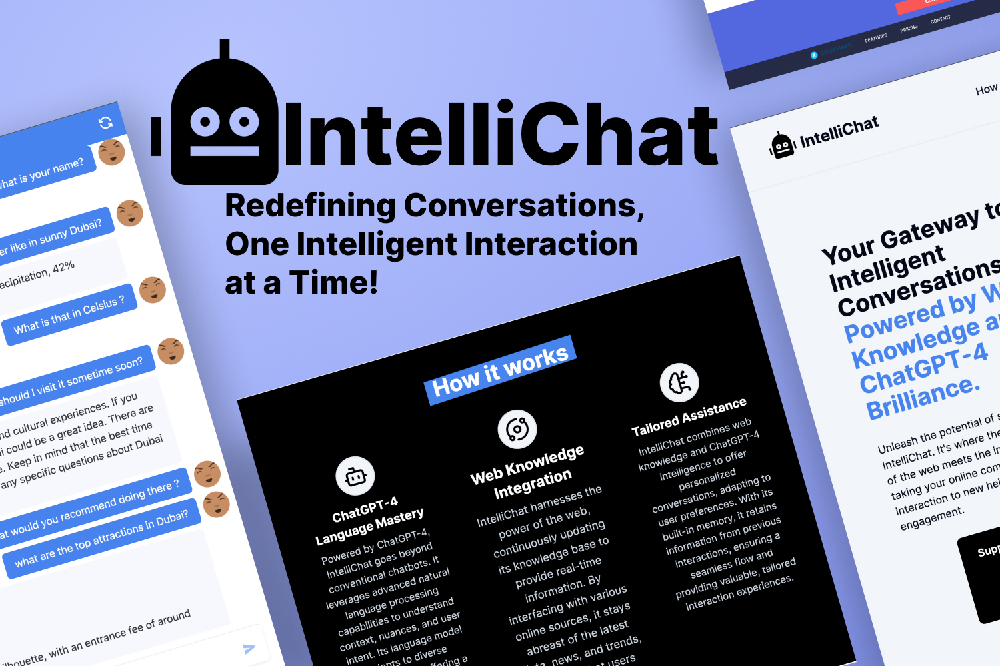

# [IntelliChat 🔗](https://intelli-chat-bot.vercel.app/)

IntelliChat is an advanced Language Model-based chat system that leverages the power of ChatGPT-4 to engage in natural, flowing conversations with users. Unlike traditional chatbots, IntelliChat is designed to remember past interactions by storing them in a database, allowing users to pick up conversations right where they left off. A standout feature of IntelliChat is its capability to access the internet through an API endpoint, giving it the ability to "Google" information, thus significantly broadening its conversational scope beyond that of ChatGPT.

## Features

- **Next.js Framework**: Built on Next.js, IntelliChat enjoys the benefits of a powerful React framework that enables server-side rendering and static site generation, ensuring a fast and scalable user experience.
- **TailwindCSS Integration**: Styles are crafted with TailwindCSS, a utility-first CSS framework that allows for highly customizable designs without leaving the HTML.
- **Secure Authentication**: User authentication is managed seamlessly with Clerk, providing a secure and hassle-free login experience.
- **Persistent Memory**: Connected to Upstash, IntelliChat ensures conversations are not lost, enabling memory retrieval and persistent user interaction.
- **Web Search Capability**: Utilizing Serp API and a Custom News Tool API by Serper API, IntelliChat can search the web to provide users with accurate and up-to-date information.
- **Built-in Calculator**: Users can perform mathematical calculations directly within the chat, thanks to the integrated calculator feature.
- **Custom Styling**: The UI has been enhanced with a forked npm package from Flowise, tailored specifically to match the aesthetics and functionality of IntelliChat.

## About the Bot

- **User Interface**: The bot's user interface is designed by Flowise, ensuring a sleek and intuitive interaction.
- **ChatGPT-4**: At its core, the bot runs on the sophisticated ChatGPT-4 model, enabling nuanced and context-aware conversations.
- **Data Storage**: Conversation data is stored with Upstash for quick retrieval and continuity across sessions.
- **Search and API Tools**: Implements Serp API and Custom News Tool API by Serper API for real-time web search, vastly extending the bot's capabilities.
- **Calculator**: A built-in calculator is provided for instant arithmetic solutions.
- **Flowise Styling**: The UI is further customized using a forked npm package from Flowise to ensure the bot's look and feel align perfectly with IntelliChat's theme.

## Hosting Features

- **Vercel**: IntelliChat is hosted on Vercel, offering an optimized cloud platform for frontend frameworks and static sites.
- **Railway**: The backend infrastructure is deployed on Railway servers, ensuring reliable and continuous service delivery.

## Support IntelliChat

If you're enjoying IntelliChat and would like to support its development, consider buying me a coffee on [Ko-fi ☕](https://ko-fi.com/danielsperanskiy). Your support helps keep the project alive and evolving!

## Get Involved

I am always looking for fellow enthusiasts to collaborate and improve IntelliChat! If you're interested in contributing to the project, have suggestions, or want to report any bugs, please feel free to reach out. Your input is invaluable and together we can make IntelliChat even better. Let's connect and discuss how you can become a part of this exciting journey! 🤝👨‍💻

You can contact me through [GitHub Issues](https://github.com/Danieldo1/Intelli-bot/issues) for bug reports and feature requests or reach out directly via [email](mailto:daniel.speranskiy@gmail.com). Looking forward to hearing from you!

---

Let's build the future of AI communication together! 🌟🤖

